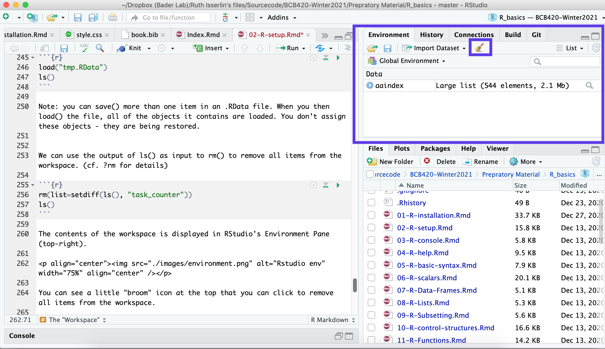

#Setup R to work with it {#r-setup}
(R projects; working with git version control via RStudio; the history mechanism and why not to use it; .Rprofile to customize startup behaviour; the working directory.)

## Overview
###Abstract:
This unit discusses the setup of a working session with RStudio.

### Objectives:

This unit will:

  * introduce R projects;
  * start working with git version control via RStudio;
  * discuss the history mechanism and why not to use it;
  * mention .Rprofile to customize startup behaviour; and
  * teach you to define the Working Directory of an R session.

### Outcomes:

After working through this unit you:

  * have verified that you can install R projects from GitHub;
  * know what the .Rprofile file is for;
  * can get and set the path of the current Working Directory.
  
### Deliverables:
**Time management**: Before you begin, estimate how long it will take you to complete this unit. Then, record in your course journal: the number of hours you estimated, the number of hours you worked on the unit, and the amount of time that passed between start and completion of this unit.

**Journal**: Document your progress in your Course Journal. Some tasks may ask you to include specific items in your journal. Don't overlook these.

**Insights**: If you find something particularly noteworthy about this unit, make a note in your insights! page.

### Prerequisites 
[RPR-Installation (Installing R and RStudio)](#r_install)


## Your Course Folder

Your Course Folder should already exist.

Take note! When you write a Windows paths in an R command, you have to use the "wrong" forward slash to separte directories and files. R will translate these "Unix-style"" paths into Windows-style paths automatically when it negotiates with the operating system. But the backslash is interpreted as an "escape" character that gives the character the follows it a special meaning.^[For example C:Documents\new would be interpreted as C:Documents<linebreak>ew because \n is the linebreak character. Even though that's actually the path name on Windows, in an R command you have to write C:Documents/new]

**Folder name and path examples**<br>

<span style="background-color: #a9f08d">/Users/Pierette/Documents/BCB420</span>  ◁ Looking good on a Mac.

<span style="background-color: #a9f08d">C:\\Users\\Pulcinella\\Documents\\CBW</span>  ◁ Looking good on a Windows computer.

<span style="background-color: #a9f08d">"C:/Users/Pulcinella/Documents/CBW"</span>  ◁ Looking good inside R on a Windows computer (note the quotation marks!).

<span style="background-color: #f0948d">C:\\Users\\Pantalone\\Documents\\BCH1441 (2017)</span>  ◁ Wrong. No special characters please.

<span style="background-color: #f0948d">/Users/Brighella/Documents/UofT Stuffz/Courses/more/Comp Sys biol. course </span> ◁ Wrong. Please read instructions more carefully.

<span style="background-color: #f0948d">C:\\Users\\Tartaglia\\Documents\\KUWTK\\\<Coursecode\></span>  ◁ I can't even ...

 
## "Projects"

We will make extensive use of "projects" in class. Read more about projects in RStudio [here](https://support.rstudio.com/hc/en-us/articles/200526207-Using-Projects).
 
## Git Version control

We will also make extensive use of version control. In fact, we will now load a project via Git version control from its free, public repository on [GitHub](https://github.com/).

`r task_counter <- task_counter + 1`
## Task `r task_counter` - Git 

```{block, type="rmd-task"}
  * Read more about [Version Control in RStudio here](https://support.rstudio.com/hc/en-us/articles/200532077-Version-Control-with-Git-and-SVN).
  * Follow the instructions to install git on your computer.
  
Then do the following:

  * open RStudio
  * Select File → NewProject...
  * Click on Version Control
  * Click on Git
  * Enter https://github.com/hyginn/R_Exercise-BasicSetup as the Repository URL.
  * Type a <tab> character, the Project directory name field should then autofill to read R_Exercise-BasicSetup
  * Click on Browse... to find your Course Folder. (The one that you have already created).   (**If you are using docker make sure the directory you choose is in the projectes directory so it gets stored in your mapped volume on your machine**)
  * Click Open.
  * Click Create Project; the project files should be downloaded and the console should prompt you to type init() to begin.
  * Type init() into the console pane.
  * An R script should load.
  * Explore the script and follow its instructions.
```


```{block, type="rmd-troubleshooting"}
  1. I get an error message: **"Git not found".**
    * The simplest reason is that you may have had RStudio open while installing git. Just restart RStudio.
    * The executable for Git (the Git "program" - "git.exe" on Windows, "git" elsewhere) needs to be on your system's path, or correctly specified in RStudio's options. The correct "path" to Git will depend on your operating system, and how git was installed. To find where git is installed –
    * On Mac and Unix systems, open a Terminal window^[The Terminal app is in the Utilities sub-folder of your Applications folder.] and type which git. This will either print the path (Yay), or tell you that git is not found. The latter could have two reasons: either git has no been installed in the first place, or it has been installed in a non-standard location by whatever installation manager you have used. Ask Google to help you figure out how to solve your specific case.
    * On Windows you can find the location of the executable by searching "git.exe" in your "programs and files". Once it's been found, right click on it and select "Open file location" from the options. It might be in C:\Program Files\Git\cmd\git.exe but the exact location depends on your operating system.
    * Once you know the path to your git executable, open File → Preferences, click on the Git/SVN option, click on the Browse button, and find the correct folder. On Macs you may need to click <shift> <command> G to open the "Go to ..." dialogue, then type the top-folder of the path (e.g. /usr) and click your way down to folder where the program lives. Find the installation directory and select git.exe. Then click "ok".
    * Then try again to create the project and let us know what happened in case it still did not work.

 
  1. **I get an error message like "directory exists and is not empty".**
  
    * A directory with the name of the project already exists in the location in which you are asking RStudio to create the project (the Course Folder). Either delete the existing directory, or install the project into a different parent directory.

 
  1. The git icon has disappeared.
    * I have seen this happen when somehow the path to git has changed.
      a. Make sure the correct path to git is set in your File → Preferences → Git/SVN.
      a. Open Tools → Project options... → Git/SVN. Next to Version control system git must be selected, not (None). If it is (None), change this to git. If that's not an option, the path is not correct. Go back to (A).
      a. I think you may need to restart RStudio then and reload your project via the Files → Recent projects... menu for the git icon and the version control options to reappear.

```

 
## Working directory

To locate a file in a computer, one has to specify the filename and the directory in which the file is stored; this is also called the path of the file. However R uses a default *working directory*, which is assumed if no path is specified. This *working directory* for **R** is either the directory in which the **R**-program has been installed, or some other directory, that has been defined in a startup script, or specifically defined with the command setwd("<working Directory>") at any time. You can execute the command getwd() to list what the Working Directory is currently set to:


```{r}
getwd()
```

In RStudio, the contents of the working directory is listed in the Files Pane (lower-right).

<p align="center"></p> 

It is convenient to put all your **R**-input and output files into a project specific directory and then define this to be the "Working Directory". Use the setwd() command for this. setwd() requires an argument that you type between the parentheses: a string with the directory path, or a variable containing such a string. Strings in **R** are delimited with " or ' characters. If the directory does not exist, an Error will be reported. Make sure you have created the directory. On Mac and Unix systems, the usual shorthand notation for relative paths can be used: ~ for the home directory, . for the current directory, .. for the parent of the current directory.

If you use a Windows system, you need to know that backslashes – "\\" – have a special meaning for **R**, they work as escape characters. For example the string "\\n" means newline, and "\\t" means tab. Thus **R** gets confused when you put backslashes into string literals, such as Windows path names. **R** has a simple solution: you simply use forward slashes instead of backslashes when you specify paths, and **R** will translate them correctly when it talks to your operating system. Instead of C:\\documents\\projectfiles you write C:/documents/projectfiles. **Also note that on Windows the ~ tilde is a shorthand for the directory in which R is installed, not the user's home directory**.


My home directory...

```{r message=FALSE, warning=FALSE}
original_dir <- getwd()
setwd("~") # Note: ~ is the "tilde" - the squiggly line - not the straight hyphen
getwd()
```

Relative path: home directory, up one level, then down into baderlab's home directory)

```{r message=FALSE, warning=FALSE}
setwd("~/../")
getwd()
```

Absolute path: specify the entire string)
```{r}
setwd("/home/rstudio/projects")
getwd()
```

Reset the directory to the original directory
```{r}
setwd(original_dir) 
```

In RStudio you can use the Session → Set Working Directory menu: 

<p align="center"></p> 

This includes the useful option to set the current project directory as the working directory ^[Projects that I create for teaching are configured to use this option by default, thus once the project is loaded, the Working Directory should already be correctly set.].

Or in the Files browser in the bottom right by clicking on the *More* option:
<p align="center"></p> 

You can set the current directory to the *working directory*.


`r task_counter <- task_counter + 1`
## Task `r task_counter`- Working directory

```{block, type="rmd-task"}

  * Since you have gone through the script of the BasicSetup project, your working directory should be set to this project directory (I have configured the project to do this automatically.)
  * Figure out the path to its parent directory - i.e. the course- or workshop directory you created at the beginning.
  * Use setwd("<your/path/and/directory/name>") to set the Working Directory to the Course Folder.
  * Confirm that this has worked by typing getwd() and list.files().
  * The Working Directory functions can also be accessed through the Menu, under Misc.

```

## .Rprofile - startup commands

Often, when working on a project, you would like to start off in your working directory right away when you start up **R**, instead of typing the setwd() command. This is easily done in a special **R**-script that is executed automatically on startup^[Actually, the first script that runs is Rprofile.site which is found on Linux and Windows machines in the C:\\Program Files\\R\\R-{version}\\etc directory. But not on Macs.]. The name of the script is .Rprofile and **R** expects to find it in the user's home directory. You can edit these files with a simple text editor like Textedit (Mac), Notepad (windows) or Gedit (Linux) - or, of course, by opening it in RStudio - don't forget that a code editor is also a text editor^[Operating systems commonly hide files whose name starts with a period "." from normal directory listings. All files however are displayed in RStudio's File pane. Nevertheless, it is useful to know how to view such files by default. On Macs, you can configure the Finder to show you such "hidden files" by default. To do this: (i) Open a terminal window; (ii) Type: $defaults write com.apple.Finder AppleShowAllFiles YES (iii) Restart the Finder by accessing Force quit (under the Apple menu), selecting the Finder and clicking Relaunch. (iV) If you ever want to revert this, just do the same thing but set the default to NO instead.].

Besides setting the working directory, other items that might go into such a file could be

  * libraries that you often use
  * constants that are not automatically defined
  * functions that you would like to preload.

For more details, use R's help function:
```{r}
?Startup
```

`r task_counter <- task_counter + 1`
## Task `r task_counter` - .Rprofile

```{block, type="rmd-task"}
Just for information:

  * locate the .Rprofile file in the RStudio file pane;
  * click on it to open it in the text-editing window.
  * This way you could change it and save the changes. However, don't do that now but Close the file again.
```
 

## The "Workspace"
During an **R** session, you might define a large number of **R**-objects: variables, data structures, functions etc., and you might load packages and scripts. All of this information is stored in the so-called "Workspace". When you quit **R** you have the option to save the Workspace; it will then be restored in your next session. Now, you might think: how convenient - I can just stop **R**, and when I restart it, it will go into the same state as it was. But no. Restoring the Workspace from a previous state is actually a bad idea: if you load data or variables in a startup script, they may be overwritten with a corrupted version that you happened to save in the workspace when you last quit. This is very hard to troubleshoot. Essentially, when you save and reload your Workspace habitually, you have overlapping and potentially conflicting behaviour of startup script and Workspace restore.

What I recommend instead is the following:

  * Never save the Workspace.
  * Always work from scripts.
  * Write your scripts so that you can easily recreate all objects you need to continue your analysis.
  * If some objects are expensive to compute, you can always save() and later load() them explicitly. In fact, restoring the Workspace does the same thing, but you have less control regarding whether the version of your objects are correct, and what temporary variables may be loaded as well.
  * In this way, you work with explicit instructions, not implicit behaviour.
  * Explicit beats implicit.

List the current workspace contents: initially it only contains the init() function that was loaded from the .Rprofile script on startup.

```{r}
ls()
```

Initialize three variables

```{r}
a <- 3
b <- 4
c <- sqrt(a^2 +b^2)
ls()
```

Save one item in an .RData file.
```{r}
save(a, file = "tmp.RData")
```

Remove one item from the Workspace. (Note: the argument for rm() is not the string "a", but the variable name a. No quotation marks!)

```{r}
rm(a)
ls()
```

Load what you previously saved.

```{r}
load("tmp.RData")
ls()
```

Note: you can save() more than one item in an .RData file. When you then load() the file, all of the objects it contains are loaded. You don't assign these objects - they are being restored.


We can use the output of ls() as input to rm() to remove all items from the workspace. (cf. ?rm for details)

```{r}
rm(list=setdiff(ls(), "task_counter"))
ls()
```

The contents of the workspace is displayed in RStudio's Environment Pane (top-right). 

<p align="center"></p> 

You can see a little "broom" icon at the top that you can click to remove all items from the workspace.

## Self-evaluation

##Further reading, links and resources
 


 
**If in doubt, ask!**<br>
If anything about this learning unit is not clear to you, do not proceed blindly but ask for clarification. Post your question on the course mailing list: others are likely to have similar problems. Or send an email to your instructor.

```{block2, type="rmd-original-history"}
<br>**Author**: Boris Steipe <boris.steipe@utoronto.ca> <br>
**Created**: 2017-08-05<br>
**Modified**: 2019-01-07<br>
Version: 1.1.1<br>
**Version history**:<br>
1.1.1 Maintenance<br>
1.1 Fixed display bug with "=" in template code; moved to GeSHi formatting.<br>
1.0 Completed to first live version<br>
0.1 Material collected from previous tutorial<br>
``` 
 

### Updated Revision history
```{r echo=FALSE}
source("./bcb420_books_helper_functions.R")
knitr::kable(githistory2table(git2r::commits(repo=".",path=knitr::current_input())))

```

### Footnotes: